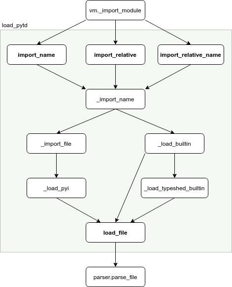

# Type stubs

<!--ts-->
   * [Type stubs](#type-stubs)
      * [Introduction](#introduction)
      * [Imports](#imports)
      * [Parser](#parser)
      * [AST manipulation](#ast-manipulation)
      * [Stub generation](#stub-generation)
      * [Optimizations](#optimizations)
         * [AST simplification](#ast-simplification)
         * [Pickling](#pickling)

<!-- Added by: rechen, at: 2020-11-23T02:16-08:00 -->

<!--te-->

## Introduction

A *type stub* is a file with a `.pyi` extension that describe a module's types
while omitting implementation details. For example, if a module `foo` has the
following source code:

```python
class Foo:
  CONSTANT = 42

def do_foo(x):
  return x
```

then `foo.pyi` would be:

```python
from typing import TypeVar

T = TypeVar('T')

class Foo:
  CONSTANT: int

def do_foo(x: T) -> T: ...
```

pytype allows an unannotated parameterized class's contained type to be changed,
an operation we call a *mutation*, which .pyi files do not have a way of
expressing. Thus, pytype uses an extended pyi format, PyTypeDecl ("Python Type
Declaration") or *PyTD*, in which mutations are described by assignment to
`self` in a method body. For example, pytype's `builtins.pytd` types
`dict.update` as:

```python
class dict(Dict[_K, _V]):
  def update(self, other: dict[_K2, _V2]) -> None:
    self = dict[Union[_K, _K2], Union[_V, _V2]]
```

In practice, the terms `pyi` and `pytd` are often used interchangeably.

pytype relies on the stubs provided by the open-source [typeshed][typeshed]
project for most of its standard library and third party type information. For
modules for which accurate mutation information is important, we shadow the
typeshed stubs with custom pytd stubs located in
[pytype/pytd/{builtins,stdlib}][pytd].
During analysis, pytype
will emit stubs of inferred type information for local files to communicate
between `pytype-single` runs.

## Imports

Import resolution is handled by the [load_pytd.Loader][load_pytd.Loader] class,
which loads type stubs into a cached internal AST representation. The loader
finds stubs for local files in one of two ways:

* When the `--imports_info` flag is passed, this flag point to a file that maps
  all module paths to file paths, which is used to look up the import.
* Otherwise, we search for a module or package with the given name in the
  current directory.

The second approach is used by `pytype-single` by default, but pytype's
whole-project analysis tools always pass in `--imports_info` for more reliable,
reproducible stub finding. The pytype GitHub project uses
[importlab][importlab], another Google open-source project, to generate the
dependency graph from which imports_info is constructed.

If an import can't be resolved locally, pytype falls back to the standard
library, then typeshed/third_party.

The following diagram shows a common import resolution path: the VM calls the
loader, which finds the right file path and then parses the contents into an
AST. The bolded methods are the entrypoints into the loader, which also happen
to be the methods that do AST postprocessing and finalization.



## Parser

The stub parser in [pytype/pyi][pytype.pyi] reads in a type stub and produces an
AST representation of its contents. Its structure is as follows:

`lexer.lex` turns the stub contents into a stream of tokens. `parser.yy` (the
grammar) matches on the tokens and produces expressions that build AST nodes.
`parser.h` declares names that appear in these expressions, and `parser.py`
implements the expressions. `parser_ext.cc` describes the mappings between names
in each step of the process.

A few examples:

* A string produces a `t::STRING` token. `parser_ext.cc` maps `t::STRING` to the
  name `STRING`, which the grammar can then use to refer to strings.
* The `...` constant produces a `t::ELLIPSIS` token, which `parser_ext.cc` maps
  to the name `ELLIPSIS` that the grammar then uses. The grammar outputs the
  expression `kEllipsis`, which is declared in `parser.h` and mapped by
  `parser_ext.cc` to a value again named `ELLIPSIS`. Finally, the `ELLIPSIS`
  value is defined in `parser.py` as an attribute on the `Parser` class.
* The grammar outputs an expression that calls a function, `kNewClass`, in order
  to build a class node. `parser.h` declares `kNewClass`, and `parser_ext.cc`
  maps it to the name of the implementation, `new_class`, which is defined in
  `parser.py` as a method of the `Parser` class.

The AST nodes are defined in
[pytype/pytd/pytd.py][pytype.pytd.pytd] as collections.namedtuple objects whose
attributes may be other namedtuples.

## AST manipulation

AST nodes are manipulated via a visitor interface. A visitor has `Enter` and
`Visit` methods for pre- and post-order traversal of the tree, as well as
`Leave` methods for cleanup (more detail [here][node._VisitNode]). For example,
`pytype.pytd.pytd_visitors.PrintVisitor`, which produces a string representation
of an AST, contains the following (simplified) logic for visiting a class:

```python
def VisitClass(self, node):
  parents_str = "(" + ", ".join(node.parents) + ")"
  header = ["class " + node.name + parents_str + ":"]
  method_lines = sum((m.splitlines() for m in node.methods), [])
  methods = ["  " + m for m in method_lines]
  return "\n".join(header + methods) + "\n"
```

Nodes of type `pytype.pytd.pytd.Class` are passed to this method, which returns
a string representation of its input. Note that, because the class's children
have already been visited, they are strings by the time `VisitClass` runs.

## Stub generation

When pytype finishes analyzing a module that another module depends on, it
outputs a type stub for the former that the latter will use to resolve imports.
The [`pytype.output`][pytype.output] module is responsible for converting the
[abstract values][abstract-values] produced by pytype's shadow bytecode
interpreter into AST nodes.

NOTE: Conversely, [`pytype.convert`][abstract-from-pytd] converts AST nodes into
abstract values.

The `output` module contains two core methods: `value_to_pytd_def`, which
converts an object to its definition (for example, `InterpreterClass(Foo)` to
`class Foo: ...`); and `value_to_pytd_type`, which converts to the type
(`InterpreterClass(Foo)` to `Type[Foo]`). For convenience, these methods can be
accessed as `to_pytd_def` and `to_type`, respectively, on abstract values.

## Optimizations

### AST simplification

To decrease the size of emitted type stubs, pytype runs the visitors in
[`pytype.pytd.optimize`][pytype.pytd.optimize] to simplify ASTs as much as
possible before serializing them. This also ensures that equivalent nodes are
reduced to a canonical form.

For example, suppose pytype is analyzing the following code, which describes a
simple company structure:

```python
class Employee:
  pass
class CEO(Employee):
  pass
class Company:
  def __init__(self):
    self.employees = [CEO()]
  def hire(self, employee: Employee):
    self.employees.append(employee)
```

pytype produces a raw pyi in which `Company.employees` is inferred to be a list
of both CEOs and employees:

```python
from typing import List, Union
class Employee: ...
class CEO(Employee): ...
class Company:
  employees: List[Union[CEO, Employee]]
  def __init__(self) -> None: ...
  def hire(self, employee: Employee) -> None: ...
```

The `optimize.SimplifyUnionsWithSuperclasses` visitor then notices that a CEO is
a type of employee and simplifies the pyi to:

```python
from typing import List
class Employee: ...
class CEO(Employee): ...
class Company:
  employees: List[Employee]
  def __init__(self) -> None: ...
  def hire(self, employee: Employee) -> None: ...
```

### Pickling

For improved performance, pytype will read and write pickled pyi files instead
of plaintext when run with:

```shell
--pickle-output --use-pickled-files --precompiled-builtins
```

The [`pytype.pytd.pytd_utils.{Load,Save}Pickle`][pickle-utils] methods can be
used to debug pickles.

[abstract-from-pytd]: abstract_values.md#construction
[abstract-values]: abstract_values.md

[importlab]: https://github.com/google/importlab

[load_pytd.Loader]: https://github.com/google/pytype/blob/2d8c8960ce8621c9c3d883d44eb3fc219355bd2b/pytype/load_pytd.py#L112

[node._VisitNode]: https://github.com/google/pytype/blob/0206bf70c0ebc6e2ab3db12e35045aa05ff0ae02/pytype/pytd/parse/node.py#L263

[pickle-utils]: https://github.com/google/pytype/blob/0206bf70c0ebc6e2ab3db12e35045aa05ff0ae02/pytype/pytd/pytd_utils.py#L445-L475

[pytd]: https://github.com/google/pytype/tree/master/pytype/pytd

[pytype.output]: https://github.com/google/pytype/blob/master/pytype/output.py

[pytype.pyi]: https://github.com/google/pytype/tree/master/pytype/pyi

[pytype.pytd.optimize]: https://github.com/google/pytype/blob/master/pytype/pytd/optimize.py

[pytype.pytd.pytd]: https://github.com/google/pytype/blob/master/pytype/pytd/pytd.py

[typeshed]: https://github.com/python/typeshed
